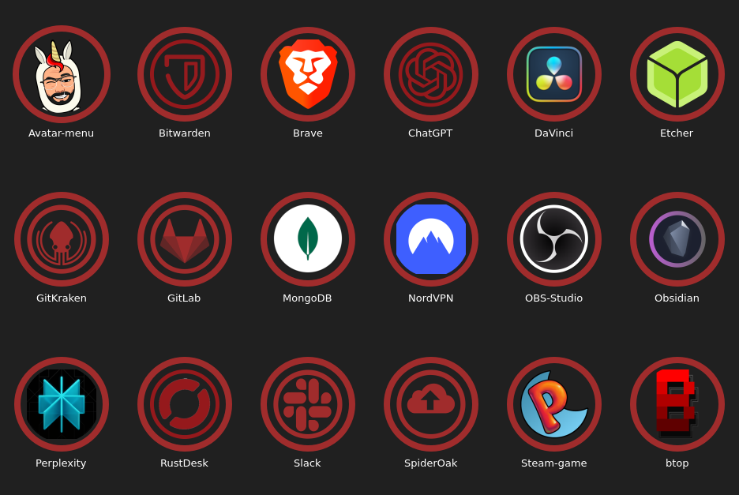

# 🔴 Marvin Red Circles

> Il tema di icone che nessuno aveva chiesto, ma che i **veri fan** stavano
> chiaramente aspettando.

**Versione 1.0 · Fan service stabile · Unicorno incluso**



## Cos'è questa meraviglia?

**Marvin Red Circles** è un tema di icone per KDE Plasma basato su
**Simply-Red-Circles**, personalizzato con più rosso, più cerchi e una quantità
scientificamente non necessaria di Marvin.

È pensato per chi guarda il menu delle applicazioni e pensa:

> «Bello, ma sarebbe ancora meglio con un unicorno, gli occhiali e dei baffi
> impeccabili.»

Se questa frase ti sembra ragionevole, benvenuto. Sei nel posto giusto.

## Test di idoneità

| Il tuo livello | Risultato |
| --- | --- |
| «Vorrei solo delle icone rosse» | Utente occasionale |
| «I cerchi migliorano qualsiasi desktop» | Persona di cultura |
| «L'avatar di Marvin deve essere il pulsante del menu» | **Vero fan certificato™** |

Nessun certificato verrà realmente spedito. Anche perché richiederebbe una
stampante configurata correttamente su Linux.

## Cosa contiene

- l'estetica rossa e circolare di Simply-Red-Circles;
- icone aggiuntive per le applicazioni che il tema originale non conosceva;
- versioni Marvin-approved di Bitwarden, ChatGPT, GitKraken, GitLab, Slack,
  SpiderOak e RustDesk;
- supporto per applicazioni KDE, Flatpak, Steam e altri abitanti del desktop;
- fallback intelligenti verso Breeze e `hicolor`;
- un easter egg che, tecnicamente, è grande quanto l'intero menu applicazioni.

Il tema è un *overlay*: contiene solo le personalizzazioni e le icone mancanti,
mentre eredita tutto il resto. Meno duplicati, meno megabyte sprecati, più
spazio per foto di unicorni.

## 🦄 L'easter egg supremo

L'icona del menu applicazioni viene sostituita dall'avatar-unicorno di Marvin.

Sono inclusi il nome realmente usato dalla configurazione originale
(`supertux`) e i principali alias KDE:

```text
application-menu
distributor-logo
start-here
start-here-kde
supertux
```

L'avatar è disponibile anche come `marvin-avatar`, nel caso tu voglia
diffonderlo responsabilmente in altre zone del desktop. O irresponsabilmente:
non siamo qui per giudicare.

## Requisiti estremamente selettivi

- KDE Plasma;
- il tema **Simply-Red-Circles** installato;
- apprezzamento per il colore rosso;
- tolleranza agli easter egg autobiografici.

Senza Simply-Red-Circles il tema continuerà a usare i fallback Breeze, ma
perderà buona parte della sua irresistibile coerenza circolare.

## Installazione

Clona il progetto, entra nella cartella e avvia l'installazione:

```bash
git clone https://github.com/marvinpascale/Marvin-Red-Circles.git
cd Marvin-Red-Circles
./tools/install-theme.sh
```

Quindi apri:

**Impostazioni di sistema → Colori e temi → Icone → Marvin Red Circles**

Lo script non attiva automaticamente il tema. Il passaggio finale è lasciato
all'utente per preservare il libero arbitrio e ridurre le chiamate al supporto
tecnico.

### Installazione manuale

Per chi non si fida degli script ma si fida ciecamente dei README trovati su
Internet:

```bash
mkdir -p ~/.local/share/icons
cp -r Marvin-Red-Circles ~/.local/share/icons/
```

## Aggiornamento

Scarica la nuova versione e rilancia `./tools/install-theme.sh`. Lo script
sostituisce la copia installata mantenendo intatte le impostazioni di Plasma.

## Il laboratorio segreto di Marvin

Il tema distribuito contiene già gli SVG generati ed è pronto da installare.
Il comando seguente serve invece al manutentore per analizzare le applicazioni
installate e rigenerare le icone mancanti:

```bash
./tools/build-theme.py
```

Lo script legge i valori `Icon=` dei file `.desktop`, cerca le migliori
sorgenti disponibili e produce SVG autosufficienti con il caratteristico
anello `#a02c2c`.

Le icone distribuite sono già autosufficienti: avatar e lavori originali sono
incorporati direttamente negli SVG. Eventuali sorgenti modificabili possono
essere collocate nella cartella locale `assets/`, che resta facoltativa. Senza
di essa puoi installare e usare il tema continuando a vivere una vita piena e
soddisfacente.

## FAQ molto richieste da persone immaginarie

### Perché proprio dei cerchi rossi?

Perché **Marvin Irregular Beige Trapezoids** non superava i test di usabilità.

### Posso usare il tema senza essere un vero fan?

Sì. Il controllo all'avvio è puramente emotivo.

### Funziona con GNOME?

Alcune icone potrebbero funzionare, ma l'esperienza spirituale completa è
progettata per KDE Plasma.

### Hai davvero trasformato il tuo avatar nell'icona del menu?

Sì. La modestia è un'impostazione opzionale.

### Manca l'icona della mia applicazione preferita

Apri una issue indicando:

- il nome dell'applicazione;
- il valore `Icon=` del relativo file `.desktop`;
- possibilmente un SVG o un collegamento alla sorgente ufficiale del logo;
- una breve spiegazione del perché l'app meriti di entrare nel Marvinverse.

## Contribuire

Issue e pull request sono benvenute, soprattutto se portano:

- nuove icone coerenti con lo stile;
- alias per applicazioni ostinatamente creative nei nomi;
- miglioramenti allo script di generazione;
- easter egg divertenti ma non distruttivi;
- complimenti gratuiti all'avatar-unicorno.

## Nota serissima, ma solo per un momento

I nomi e i loghi delle applicazioni appartengono ai rispettivi proprietari.
Questo progetto è indipendente, non ufficiale e non implica affiliazione o
approvazione da parte degli sviluppatori dei software rappresentati.

Prima della pubblicazione definitiva, aggiungi al repository una licenza che
specifichi chiaramente le condizioni d'uso del codice e degli asset originali.

---

Realizzato con KDE, SVG, automazione e una fiducia forse eccessiva nel rosso.

**Marvin Red Circles — non è solo un tema di icone. È un fandom con una
cartella `scalable/apps`.**
